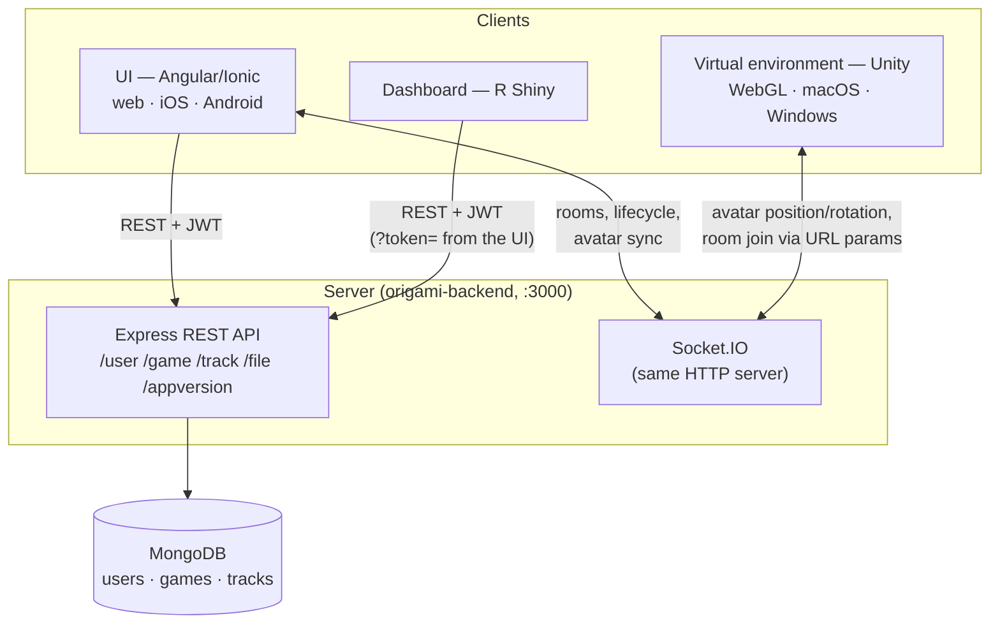

<p align="center">
  
</p>

<h1 align="center">GeoGami — Platform Overview for Developers</h1>

<p align="center">
  System architecture, component contracts, and how to run the full stack locally.<br/>
  For the platform from a study leader's perspective, see the <a href="PLATFORM_OVERVIEW.md">Researcher Overview</a>.
</p>

---

GeoGami is a four-component platform for location-based games: a cross-platform client, a central backend, an analytics dashboard, and a Unity virtual environment. The components live in separate repositories and communicate over two channels — **REST (JWT-authenticated)** for everything persistent, and **Socket.IO** for everything real-time.

## Table of contents

- [Components and tech stacks](#components-and-tech-stacks)
- [System architecture](#system-architecture)
- [Data model](#data-model)
- [Contracts between components](#contracts-between-components)
- [Running the full stack locally](#running-the-full-stack-locally)
- [Conventions](#conventions)
- [Related documents](#related-documents)

---

## Components and tech stacks

| Repository | Component | Stack | Local dev port |
|---|---|---|---|
| [geogami](https://github.com/geogami-team/geogami) | Mobile/web client ("UI") | Angular 12, Ionic 6, Capacitor 3 (iOS/Android), Leaflet + Mapbox GL | `:8100` |
| [origami-backend](https://github.com/geogami-team/origami-backend) | Backend ("server") | Node 20, Express 4, MongoDB 8 (Mongoose), Socket.IO, Passport JWT | `:3000` (+ Mongo `:27017`) |
| [geogami-dashboard](https://github.com/geogami-team/geogami-dashboard) | Analytics dashboard | R Shiny, Leaflet, Docker | `:3838` |
| [geogami-virtual-environment-dev](https://github.com/geogami-team/geogami-virtual-environment-dev) | Virtual environment ("VE") | Unity 2022.3 LTS; targets WebGL, macOS, Windows | WebGL build served at `:50544` |

The UI is the only component end users install; the dashboard and the WebGL build of the VE are reached from inside the UI (the dashboard in a new tab with a `?token=` parameter, the VE in an embedded WebGL frame or as a separate desktop app).

## System architecture



Key points:

- **One server, two protocols.** Socket.IO is mounted on the same HTTP server as Express (port 3000). There is no separate real-time service.
- **The server is the only writer to MongoDB.** The dashboard is read-only via REST; it never touches the database directly.
- **Auth is JWT end-to-end.** The UI obtains access + refresh tokens from `/user/login`; the dashboard reuses the UI's token, passed as a `?token=` URL parameter when launched from the UI's evaluate page.
- **The VE is a thin display.** Game logic, tasks, and track recording live in the UI; the VE only renders the 3D world and streams avatar state. To start a virtual game the UI embeds the VE WebGL build in an iframe (`playing-virenv` page) and passes the connection details — player name or game code, environment type, mode — as URL query parameters; both clients then join the same Socket.IO room automatically (keyed by player name in single-player, by game code in multiplayer). The VE can also run as a standalone desktop build or on a VR headset.

## Data model

The Mongoose schemas live in [origami-backend `src/models/`](https://github.com/geogami-team/origami-backend). The three central collections:

| Collection | Contents | Notable fields |
|---|---|---|
| **User** | Account, credentials, roles | `roles[]` (`user`, `scholar`, `trackAccess`, `contentAdmin`, `admin`), `refreshTokens[]` (individually revocable), `unconfirmedEmail` (safe email-change flow) |
| **Game** | A game definition: ordered task list with per-task map settings | task `category` / `questionType` / `answerType` / `evaluate`, real-world vs. virtual flag, multiplayer flag, share list (user emails granted track access) |
| **Track** | One participant play-through | waypoints (positions over time), events (timestamped task lifecycle, including answers and photos), per-task timing |

Schema changes are managed with `migrate-mongo` (see [Conventions](#conventions)).

## Contracts between components

### REST (UI ↔ server, dashboard ↔ server)

Route areas, all rooted at the server origin:

| Area | Purpose | Auth |
|---|---|---|
| `/user/*` | Register, login, token refresh, email verification, password reset, profile, admin user management | Public for auth flows; JWT for profile; `admin`/`contentAdmin` for management |
| `/game/*` | Game CRUD, public game lists, share/unshare game tracks | `GET /game/all` public; create/update with JWT; `usergames` needs an elevated role |
| `/track/*` | Store tracks during play, fetch tracks/waypoints for evaluation | Reads require `admin`/`contentAdmin`/`trackAccess`/`scholar`; writes (`POST`/`PUT /track`) are called by the player client |
| `/file/*` | Photo/file upload | JWT |
| `/appversion/*` | Client version checks | Public |

The full endpoint tables are in the [server README](https://github.com/geogami-team/origami-backend#api-overview). Role checks are middleware (`AuthController.roleAuthorization([...])`) on each route — when adding endpoints, the route file in `src/routes/<area>/` is the single place where auth is declared.

### Socket.IO (UI ↔ server ↔ VE)

The most important events are summarized below; the complete contract (all events, payloads, rooms model, sequence diagram) is in the [Socket.IO Event Reference](SOCKETIO_REFERENCE.md).

| Event | Direction | Purpose |
|---|---|---|
| `joinGame` / `newGame` | UI → server | Real-world multiplayer rooms and lifecycle |
| `joinVEGame` | VE → server | Join a virtual-game room (keyed by player name / game code from the iframe URL params) |
| `play` | VE → server | Register player, prepare avatars (multiplayer) |
| `requestInitialAvatarPositionByVirApp` | VE → UI | Ask the controller app for a start position |
| `deliverInitialAvatarPositionByGeoApp` | UI → VE | Initial position, rotation, avatar speed |
| `updateAvatarPosition` / `updateAvatarDirection` | VE → UI | Stream avatar movement to the map |
| `update_others_avatars_positions_periodically` | VE ↔ VE | Avatar sync between players in multiplayer |
| `closeVEGame` | UI → VE | Tear down the WebGL frame at game end |

Server-side handlers are in `src/index.js` of origami-backend; the VE side is in the Unity scripts under `Assets/`.

## Running the full stack locally

Bring the components up in this order:

**1. Server + MongoDB** — in `origami-backend`:

```bash
cp .env.example .env          # set Mongo + SMTP values
docker compose up --build     # API on :3000, MongoDB on :27017
```

With `NODE_ENV=development` the mailer is mocked and prints verification emails to stdout — no SMTP needed.

**2. UI** — in `geogami` (requires Node 14–16; Angular 12 breaks on newer Node):

```bash
npm install
ionic serve                   # http://localhost:8100
```

Point `src/environments/environment.ts` at your local services: `apiURL: 'http://localhost:3000'`, `dashboardURL: 'http://localhost:3838'`, plus a `mapboxAccessToken`. For virtual games also set `uiURL` and `webglURL`.

**3. Dashboard** (only needed for evaluation work) — in `geogami-dashboard`: run via Docker / `docker compose up`, serving on `:3838`. Open it through the UI's evaluate page so it receives a `?token=`; opened bare, only the offline "Upload JSON file" path works.

**4. Virtual environment** (only needed for virtual games) — open `GeoGami-Vir-Env/` with Unity 2022.3 LTS, or serve an existing WebGL build at the `webglURL` configured in the UI (`:50544` by convention).

A minimal real-world-game dev loop needs only steps 1–2.

## Conventions

- **Branches:** in the UI repo, branch from `dev`; PRs target `master`. Check each repo's README for its own flow.
- **Database migrations:** `migrate-mongo` in origami-backend (`npx migrate-mongo create/status/up`); config in `migrate-mongo-config.js`.
- **i18n (UI):** translation files at `src/assets/i18n/<locale>.json` (`en`, `de`, `fr`, `pt`, `ar`); all user-facing strings go through `| translate`.
- **Linting/tests (UI):** run `npm run lint` and the Karma tests before pushing.
- **VE releases:** built manually from Unity and published as tagged GitHub releases (WebGL, macOS, Windows).
- **License:** MIT across all repositories.

## Related documents

- [Researcher Overview](PLATFORM_OVERVIEW.md) — the platform from the study leader's perspective (study lifecycle, recorded data, exports)
- [Socket.IO Event Reference](SOCKETIO_REFERENCE.md) — the full real-time contract (events, payloads, rooms)
- [Track Data Reference](TRACK_DATA_REFERENCE.md) — the track JSON format, field by field
- [Glossary](GLOSSARY.md) — domain vocabulary (games, tasks, tracks, map settings, …)
- Component READMEs: [UI](https://github.com/geogami-team/geogami) · [server](https://github.com/geogami-team/origami-backend) · [dashboard](https://github.com/geogami-team/geogami-dashboard) · [virtual environment](https://github.com/geogami-team/geogami-virtual-environment-dev)
- Planned (see [README](README.md)): full REST API reference

---

**Contact:** Spatial Intelligence Lab (SIL), Institute for Geoinformatics, University of Münster — geogami(at)uni-muenster.de — <https://geogami.ifgi.de>
