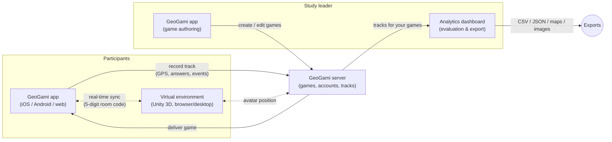

  

<h1 align="center">GeoGami — Platform Overview for Researchers & Study Leaders</h1>

  How the GeoGami platform fits together, how a study flows through it, and what data you get out. 
  Working on the code instead? See the <a href="DEVELOPER_OVERVIEW.md">Developer Overview</a>.

---

GeoGami is a location-based game platform built by the **Spatial Intelligence Lab (SIL)** at the Institute for Geoinformatics, University of Münster. It lets you **create map-based games, have participants play them in the real world or in a virtual 3D environment, and analyze the resulting movement and answer data** — making it a complete toolchain for training and studying spatial cognition.

This document explains the platform from the perspective of a **researcher or study leader**: someone who designs games as study instruments, runs sessions with participants, and evaluates the recorded data.

## Table of contents

- [The four components](#the-four-components)
- [How the components work together](#how-the-components-work-together)
- [The study lifecycle](#the-study-lifecycle)
- [What data is recorded](#what-data-is-recorded)
- [Real-world vs. virtual games](#real-world-vs-virtual-games)
- [Accounts, roles, and data access](#accounts-roles-and-data-access)
- [Related documents](#related-documents)

---

## The four components

| Component | What it is | You use it to… |
|---|---|---|
| **GeoGami app** ([geogami](https://github.com/geogami-team/geogami)) | Mobile/web app (iOS, Android, browser) | Create and edit games; participants use it to play |
| **GeoGami server** ([origami-backend](https://github.com/geogami-team/origami-backend)) | Central backend and database | (Runs in the background — stores accounts, games, and all recorded tracks) |
| **Analytics dashboard** ([geogami-dashboard](https://github.com/geogami-team/geogami-dashboard)) | Browser-based analysis tool | Inspect sessions, view routes on maps, compare participants, export data |
| **Virtual environment** ([geogami-virtual-environment-dev](https://github.com/geogami-team/geogami-virtual-environment-dev)) | Unity 3D virtual world (browser or desktop) | Run *virtual* games indoors or remotely — participants navigate a 3D world instead of the real one |

As a study leader you interact mainly with the **app** (game authoring, running sessions) and the **dashboard** (evaluation). The server works invisibly in the background, and the virtual environment is only needed for virtual-world studies.

## How the components work together

Everything is stored centrally on the server: every game you author and every **track** (one participant's recorded play-through) ends up there, tied to your account. The dashboard reads from the same server, so recorded sessions are available for analysis immediately after play.

## The study lifecycle

A typical GeoGami study has four phases:

### 1. Design — author the game in the app

In the app's **game creator** you build a game as a sequence of **tasks**. Two task families are available (see the [glossary](GLOSSARY.md) for the full catalogue):

- **Navigation tasks** direct the participant to a new location (shown as a flag, an arrow, a text instruction, or a photo).
- **Thematic tasks** probe specific spatial skills at a location: self-location ("Where are you? Tap the map."), object location, direction determination, or a **free task** combining any question and answer type.

Each task also carries **map settings** — these are your experimental controls. You decide per task whether the map can rotate, whether the participant's position is shown, whether the map is satellite/standard/blank, whether information is reduced, whether only a buffer around the participant is revealed, and so on. The same game logic works in real-world and virtual environments, in single-player and multiplayer mode.

### 2. Run — participants play

- **Real-world game:** the participant opens the game in the app on a phone and plays outdoors; GPS and compass drive position and heading.
- **Virtual game:** the participant controls an avatar in the Unity virtual environment (a virtual city, building, or landscape) while the app acts as the map controller. Starting a virtual game in the app produces a **5-digit code**; entering the same code in the virtual environment links the two on the server, and avatar position and heading are synced live.

During play the app records the track automatically — no extra action needed from the study leader.

### 3. Analyze — open the dashboard

From the app's **evaluate** section you launch the analytics dashboard. There you:

- pick one of your games (or a game **shared** with you by another researcher),
- load one or more **track sessions** (one per participant run),
- inspect per-task tables, routes on an interactive map, and photos taken by participants,
- compare participants per task (e.g., route length vs. time for navigation tasks, answer error for direction tasks),
- view statistics plots across sessions.

The dashboard's tabs and controls are described step by step in the [Dashboard User Guide](https://github.com/geogami-team/geogami-dashboard/blob/HEAD/docs/USER_GUIDE.md).

### 4. Export — take the data into your analysis tools

The dashboard exports at several levels:

| Export | Format | Where |
|---|---|---|
| Raw track files | JSON (zip) | Sidebar → Download |
| Per-task details for a participant | CSV | "All tasks" tab |
| Cross-participant comparison tables | CSV | "Compare Players" tab |
| Route maps | HTML (interactive) | "Map" tab |
| Statistics charts | PNG | "Statistics" tab |
| Participant photos | image files | "Pictures" tab |

The raw JSON tracks contain the complete recorded data and are suitable for custom analysis in R or Python; the dashboard can also load such a JSON file directly from disk for offline inspection.

## What data is recorded

Each participant run produces one **track** containing:

- **Waypoints** — the participant's position over time (GPS in real-world games, avatar position in virtual games), forming the route.
- **Events** — task lifecycle and interaction events (task shown, answer submitted, etc.) with timestamps.
- **Answers** — per task: the given answer (map point, direction, photo, multiple choice, text, number, …) and, where an evaluation is defined, whether/how far it was off (e.g., distance to target, point-in-polygon, direction error).
- **Photos** — any pictures the participant took as answers.
- **Timing** — start/end times per task, from which durations and route-length-vs-time measures are derived.

> **Privacy note for study design:** tracks contain fine-grained location data and possibly photos. Plan your consent forms and data-management accordingly; access in the platform is restricted (see next section), but export and downstream storage are your responsibility.

## Real-world vs. virtual games

| | Real world | Virtual world |
|---|---|---|
| Where participants are | Outdoors, on site | Indoors / remote, at a screen |
| Position source | Device GPS + compass | Avatar in the Unity environment |
| Equipment | Smartphone with the GeoGami app | Computer or browser running the virtual environment **plus** a device running the app as controller |
| Typical use | Field studies, training in real space | Lab studies, controlled conditions, remote participation |
| Task & map-feature catalogue | identical | identical (plus a layer-switch option specific to virtual worlds) |
| Multiplayer | yes | yes |

Because both environments share the same task catalogue and data format, you can use the same game design in the field and in the lab and analyze both with the same dashboard.

## Accounts, roles, and data access

- **Anyone with a verified GeoGami account** can create and play games.
- **Viewing recorded tracks** (the evaluate section and the dashboard) additionally requires an elevated role — typically **`scholar`** for researchers. Roles are assigned by an administrator; contact the GeoGami team (geogami(at)uni-muenster.de) to have your account upgraded.
- **You see your own games' tracks.** To collaborate, the game creator can **share** a game's tracks with other registered GeoGami users by email, directly from the dashboard sidebar; shared games then appear in the recipients' dashboards. Sharing can be revoked at any time by the creator.

## Related documents

- [Glossary](GLOSSARY.md) — definitions of all platform terms (game, task, track, …)
- [Dashboard User Guide](https://github.com/geogami-team/geogami-dashboard/blob/HEAD/docs/USER_GUIDE.md) — step-by-step guide to the analysis tabs
- [Task types and map features](https://github.com/geogami-team/geogami#map-features-and-task-types-in-geogami) — the full catalogue of tasks, question/answer types, and map settings
- Component READMEs for setup and deployment: [app](https://github.com/geogami-team/geogami) · [server](https://github.com/geogami-team/origami-backend) · [dashboard](https://github.com/geogami-team/geogami-dashboard) · [virtual environment](https://github.com/geogami-team/geogami-virtual-environment-dev)

---

**Contact:** Spatial Intelligence Lab (SIL), Institute for Geoinformatics, University of Münster — geogami(at)uni-muenster.de — <https://geogami.ifgi.de>
