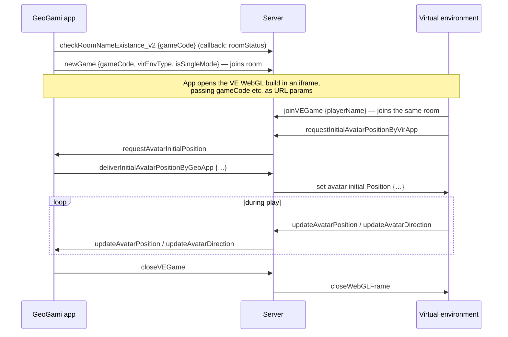

  

<h1 align="center">GeoGami — Socket.IO Event Reference</h1>

  The real-time contract between the GeoGami app, the server, and the Unity virtual environment. 
  For the architecture context, see the <a href="DEVELOPER_OVERVIEW.md">Developer Overview</a>.

---

Socket.IO is mounted on the same HTTP server as the REST API (port 3000, see `src/index.js` in [origami-backend](https://github.com/geogami-team/origami-backend)). It carries everything real-time: virtual-environment pairing and avatar sync, real-world multiplayer coordination, and the instructor view. This document lists every event, who sends it, and what the payload contains — written against the server implementation, which is the single place all events pass through.

**Participants:** `app` = the GeoGami UI (Angular/Ionic client) · `VE` = the Unity virtual environment · `server` = origami-backend.

## Table of contents

- [Rooms model](#rooms-model)
- [Conventions and gotchas](#conventions-and-gotchas)
- [Virtual game pairing & avatar sync (app ↔ server ↔ VE)](#virtual-game-pairing--avatar-sync-app--server--ve)
- [Real-world multiplayer (app ↔ server)](#real-world-multiplayer-app--server)
- [VE multiplayer avatar sync (VE ↔ server ↔ VE)](#ve-multiplayer-avatar-sync-ve--server--ve)
- [Connection & liveness](#connection--liveness)
- [Server-side state](#server-side-state)

---

## Rooms model

The server uses three kinds of Socket.IO rooms:

| Room | Name | Members | Purpose |
|---|---|---|---|
| **Pairing room** | The **player name** (single-player) or **game code** (multiplayer) — passed to the VE via the iframe URL params | One app client + one VE client | Relay avatar position/rotation and game lifecycle between a player's app and their 3D view |
| **Instructor room** | The multiplayer room name (teacher code + game) | Instructor + all players (app side) | Real-world multiplayer coordination: join/rejoin, connection status, instructor map view |
| **VE multiplayer room** | Hardcoded `multiVirRoom` | All VE clients in multiplayer mode | Sync avatars *between players* inside the virtual world |

> ⚠️ `multiVirRoom` is a single static room shared by **all** concurrent multiplayer VE sessions (marked `ToDo` in the server source). Two unrelated multiplayer virtual games running at the same time would see each other's avatars.

## Conventions and gotchas

- **No authentication.** The socket layer performs no JWT or origin checks — any client that can reach port 3000 can emit events. Keep this in mind for deployments.
- **String payloads from Unity.** The VE's socket plugin sends JSON **strings**, which the server parses: `play`, `update avatar turn`, `update_others_avatars_positions_periodically`. App-side payloads are plain objects.
- **Callback events.** `check*` events are request/response: the client passes a callback and the server invokes it with the result (Socket.IO acknowledgements).
- **Event names are inconsistent but frozen.** Several names contain typos or spaces (`changePlayerConnectionStauts`, `updateGameTrackStauts`, `updateInstrunctorMapView`, `set avatar initial Position`). They are part of the wire contract — renaming them breaks older clients, so document, don't fix, unless versioning both sides together.
- **In-memory state.** All room/player bookkeeping lives in server process memory ([see below](#server-side-state)); a server restart drops every active session.

## Virtual game pairing & avatar sync (app ↔ server ↔ VE)

Used for every virtual game (single-player and multiplayer alike — each player's app↔VE pair gets its own pairing room).

### Pairing sequence

### Events

| Event | From → To | Payload | Notes |
|---|---|---|---|
| `checkRoomNameExistance_v2` | app → server (callback) | `{gameCode}` → callback `{roomStatus: bool}` | Prevents two players from using the same name (the room key) |
| `newGame` | app → server | `{gameCode, virEnvType, isSingleMode}` | App joins the pairing room; server remembers the world type per room |
| `joinVEGame` | VE → server | `{playerName}` | VE joins the same pairing room (key arrives via iframe URL params) |
| `requestInitialAvatarPositionByVirApp` | VE → server → app | — (relayed as `requestAvatarInitialPosition`) | VE asks where the avatar should start |
| `deliverInitialAvatarPositionByGeoApp` | app → server → VE | relayed as `set avatar initial Position` with `{initialPosition, initialRotation, virEnvType, avatarSpeed, disableAvatarRotation, showEnvSettings, initialAvatarHeight, arrowDestination, showPathVisualization, mapSize, excludedObjectsNames}` | The task's full VE configuration |
| `updateAvatarPosition` | VE → server → app | `{gameCode, x_axis, z_axis, y_axis}`, relayed as `{x, z, y}` | Streamed while the avatar moves; the app converts to pseudo lat/lng for the map and track |
| `updateAvatarDirection` | VE → server → app | `{gameCode, y_axis}`, relayed as `{angleValue}` | Avatar heading |
| `updateArrowDirection` | VE → server → app | `{x_axis, z_axis, distance}`, relayed as `set next arrow point and distance` `{x, z, distance}` | Only for navigation-with-arrow tasks: nearest path point + distance |
| `closeVEGame` | app → server → VE | — (relayed as `closeWebGLFrame`) | Tear down the embedded 3D view when the game ends |
| `removeOwnAvatar` | app → server → VE room `multiVirRoom` | `{playerName}`, relayed as `removeOtherPlayersAvatars` `{name}` | Remove a finished/disconnected player's avatar from other players' worlds |
| `pingServer` | app → server | `gameCode` | Keep-alive for single-player VE games (prevents ~45 s idle disconnect) |

## Real-world multiplayer (app ↔ server)

Coordination of multiplayer games played in the real world: an **instructor** (teacher) opens a room; players join, get numbered, and report status; the instructor watches everyone on a live map.

| Event | From → To | Payload | Notes |
|---|---|---|---|
| `checkAbilityToJoinGame` | app → server (callback) | `{gameCode, gameNumPlayers}` → callback `{isRoomFull: bool}` | Checked before joining (also used by virtual multiplayer games) |
| `joinGame` | app → server | `{roomName, playerName}` | Without `playerName` ⇒ the **instructor** joins. Players are appended to the room roster |
| `assignPlayerNumber` | server → joining player | `{playerNo, playerID}` | Player's index (used e.g. for the shared multiplayer track) |
| `playerJoined` | server → others in room | `{joinedPlayersCount}` | Lets clients start the game when everyone is in |
| `checkPlayerPreviousJoin` | app → server (callback) | `{playerName, playerNo, roomName}` → callback `{isDisconnected, joinedPlayersCount}` | Reconnect flow: a returning player resumes their slot |
| `changePlayerConnectionStauts` | app → server | `"connected"` \| `"disconnected"` \| `"finished tasks"` | Also fired server-side on socket disconnect; `finished tasks` is final |
| `onPlayerConnectionStatusChange` | server → instructor | roster array `[{id, name, connectionStatus}]` | Sent on every join/status change |
| `requestPlayersLocation` | instructor app → server → players | — (relayed as `requestPlayerLocation`) | Instructor polls player positions |
| `updatePlayersLocation` | player app → server → instructor | `{roomName, playerLoc, playerNo}`, relayed as `updateInstrunctorMapView` `{playerLoc, playerNo}` | Drives the instructor's live map |
| `updateGameTrackStauts` | app → server | `{roomName, storedTrack_id}` | First player to upload the shared track registers its ID |
| `checkGameStatus` | app → server (callback) | `roomName` → callback `{trackDataStatus: {status, track_id}}` | Other players check whether to create or update the shared track |

## VE multiplayer avatar sync (VE ↔ server ↔ VE)

Avatar synchronization *between players* inside the virtual world. All of this happens in the shared `multiVirRoom`; the server keeps a roster (`virEnvClientsData`) with each player's name, position, rotation, and walk state.

| Event | From → To | Payload | Notes |
|---|---|---|---|
| `player connect` | VE → server | — | Server replies with one `other player connected` per already-connected player (name, position, rotation) so the newcomer can spawn existing avatars |
| `play` | VE → server | JSON string `{name}` | Registers the player in the roster (spawn position currently fixed at `[224, 100, 74]`, marked `ToDo`), joins `multiVirRoom`; server replies `prepareOwnAvatar` (own data) and broadcasts `other player connected` (to the rest) |
| `update_others_avatars_positions_periodically` | VE → server → other VEs | JSON string `{position}`, relayed as `update_others_avatars_position` (full player object) | Periodic absolute-position correction against drift |
| `update avatar walk` | VE → server → other VEs | walk value (number), relayed as `update others avatars walk` | Smooth walking animation on remote avatars |
| `update avatar turn` | VE → server → other VEs | JSON string `{rotation}`, relayed as `update avatar turn` | Smooth turning on remote avatars |
| `removeOtherPlayersAvatars` | server → VEs | `{name}` | Triggered by the app's `removeOwnAvatar` (player finished/left) |
| `hideShowOtherPlayersAvatars` | server → VEs | `{name}` | Fired automatically when a player's connection status flips (disconnect/reconnect) |

## Connection & liveness

| Event | From → To | Behaviour |
|---|---|---|
| `connection` | — | Standard Socket.IO connect; the server registers all handlers per socket |
| `disconnect` | — | Server marks the player `"disconnected"` (if it has `playerData` for the socket) and notifies the instructor + hides the avatar for other VE players |
| `pingServer` | app → server | Keep-alive (see pairing table) |

## Server-side state

All coordination state is held **in memory** in `src/index.js` — relevant when debugging and for deployment (restart = all live sessions drop; no horizontal scaling without sticky sessions + shared state):

| Variable | Contents |
|---|---|
| `clientRooms` | socket.id → pairing-room name (used to route relays like `closeWebGLFrame`) |
| `roomsData` | room → player roster `[{id, name, connectionStatus}]` (real-world multiplayer) |
| `gameStatus` | room → `{status, track_id}` — whether the shared multiplayer track exists yet |
| `instructorID` | room → instructor's socket.id |
| `roomVRWorldType_Mode` | room → `{virEnvType, isSingleMode}` |
| `virEnvClientsData` | `multiVirRoom` → VE player roster (name, position, rotation, walkVal, playerNo) |

---

**Related:** [Developer Overview](DEVELOPER_OVERVIEW.md) · [Track Data Reference](TRACK_DATA_REFERENCE.md) (how the synced positions end up in track files) · server handlers: `src/index.js` in [origami-backend](https://github.com/geogami-team/origami-backend)

**Contact:** Spatial Intelligence Lab (SIL), Institute for Geoinformatics, University of Münster — geogami(at)uni-muenster.de — <https://geogami.ifgi.de>
